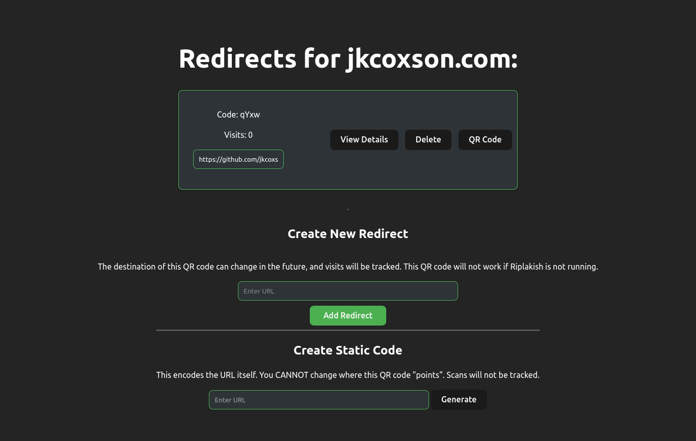
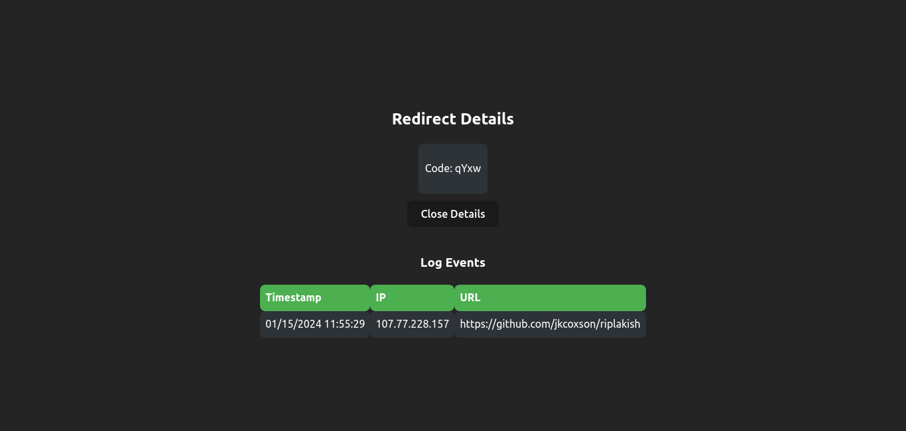
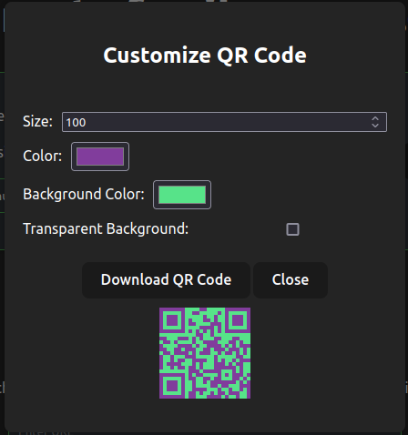

# Riplakish

A link shortener/QR code generator



## Technology

- Hosting is using Rust's Axum
- Data is stored using SQLite
- Backend is written in Rust for Blazing Speed tm
- Frontend is in Svelte
- QR Codes are generated using qrious

## Usage

Create a .env file or set the following vars

```bash
BEHIND_TRAEFIK=false
SQLITE_PATH=riplakish.db
BASE_URL=domain.com
```

This software was designed to run behind a proxy like traefik.
Configuration is done through '/admin' and API routes start with '/admin/\*'

Redirects can be accessed at {domain}/r/{code} and the IP will be logged for viewing.

## TODO

- [ ] Find a way to automatically determine where the IP is from
- [ ] Clean the code base

## Images
 
